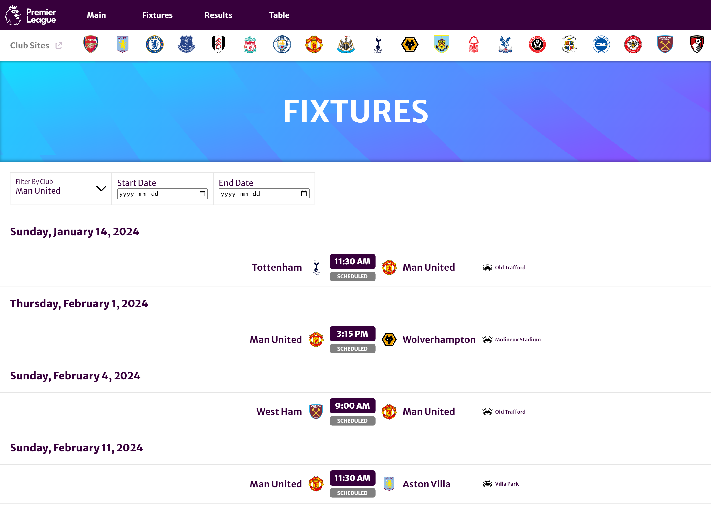
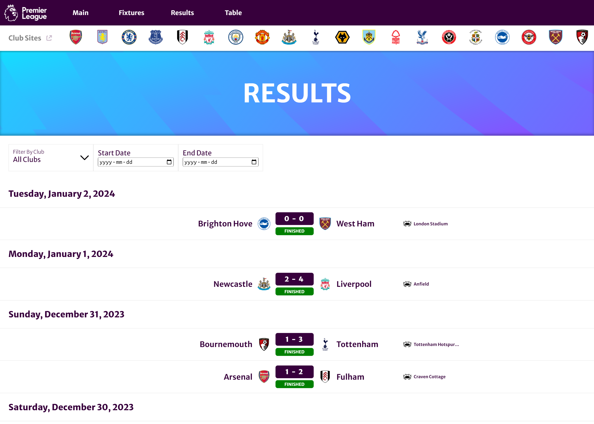
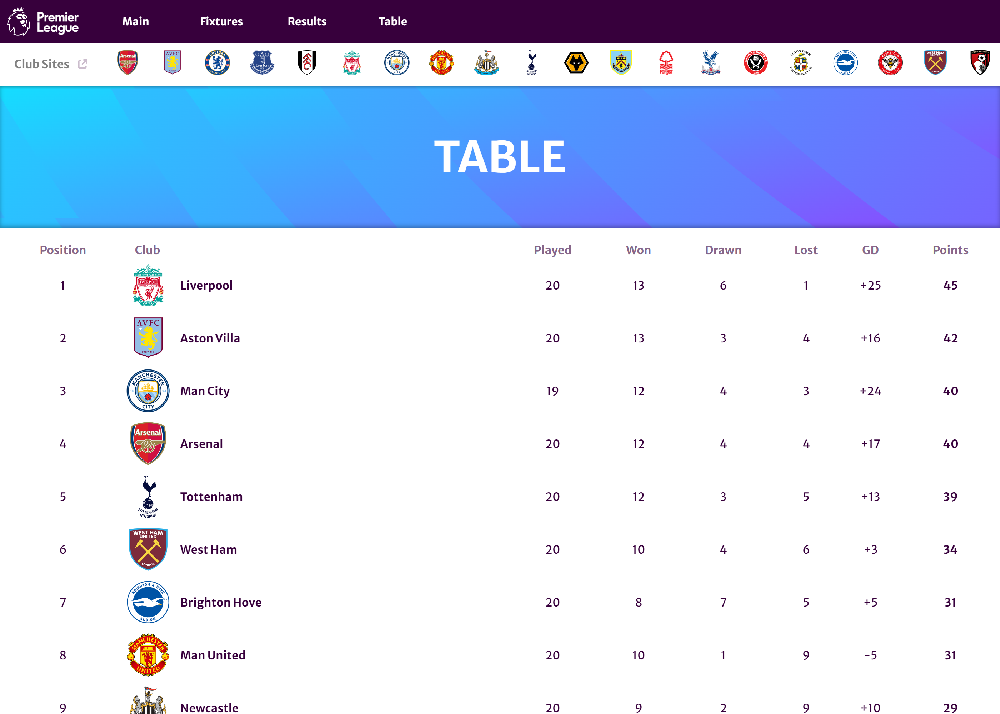

# Premier Ease (frontend) ⚽

Website that fetches and displays information about the English Premier League from external APIs.

## Deployment 🚀

https://premier-ease.vercel.app/

## Features

- Displays information on:
  - League-related news from multiple sources
  - Upcoming matches
  - Live matches (with scores updated in real time)
  - Results for past matches
  - League table

## Related

- [Premier Ease Backend](https://github.com/ClearlyyConfused/PremierEase_backend)

## Screenshots 📸

